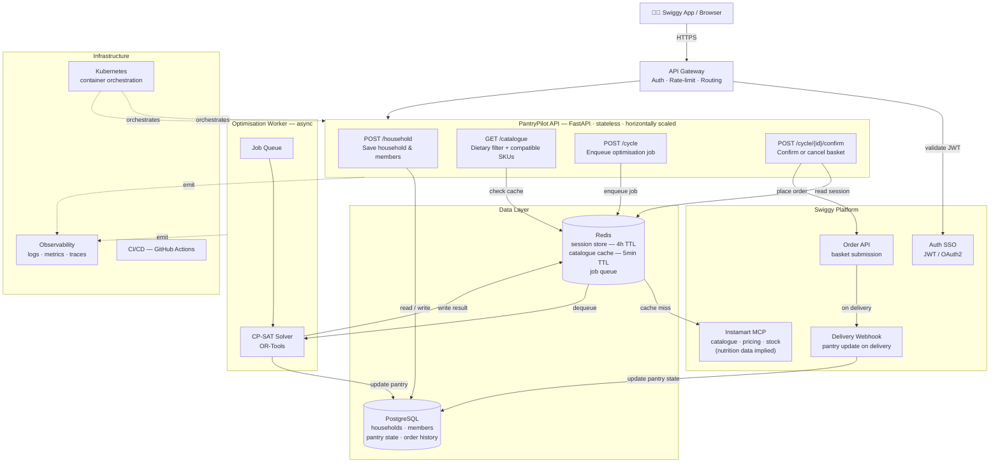

# PantryPilot — Production Architecture

## Demo → Production delta

| Concern | Demo | Production |
|---------|------|------------|
| Household store | In-memory dict | PostgreSQL |
| Session store | In-memory dict | Redis (4h TTL) |
| Catalogue | Fixture (67 mock SKUs) | Instamart MCP (live catalogue) |
| Optimisation | Synchronous in-process | Async job queue → CP-SAT worker |
| Order placement | Mock `place_confirmed()` | Swiggy Order API |
| Pantry update | Manual / fixture | Delivery webhook → PostgreSQL |
| Auth | None | Swiggy SSO (JWT / OAuth2) |
| Scaling | Single process | Stateless API pods + worker pool (K8s) |
| Nutrition data | Hardcoded in fixtures | Served by Instamart MCP |

## Key production properties

**Stateless API pods.** All shared state lives in PostgreSQL or Redis. Any pod can handle any request — scale horizontally without coordination.

**Async optimisation.** `POST /cycle` enqueues a job and returns immediately with a job ID. The client polls or receives a push notification when the result is ready. Prevents slow CP-SAT solves (large households, wide catalogues) from blocking the API.

**Catalogue cache.** Instamart pricing and stock change frequently; nutrition data does not. Redis caches the filtered catalogue per household for 5 minutes — reduces MCP round-trips on repeat optimisations.

**Pantry closed-loop.** The delivery webhook fires when Swiggy marks an order delivered, decrementing pantry quantities automatically. The next cycle starts with fresh pantry state.

**Strictest-wins is safe to scale.** Dietary/allergy filtering is stateless and deterministic — it runs in the API worker with no external calls, so it adds no latency to the catalogue fetch path.
